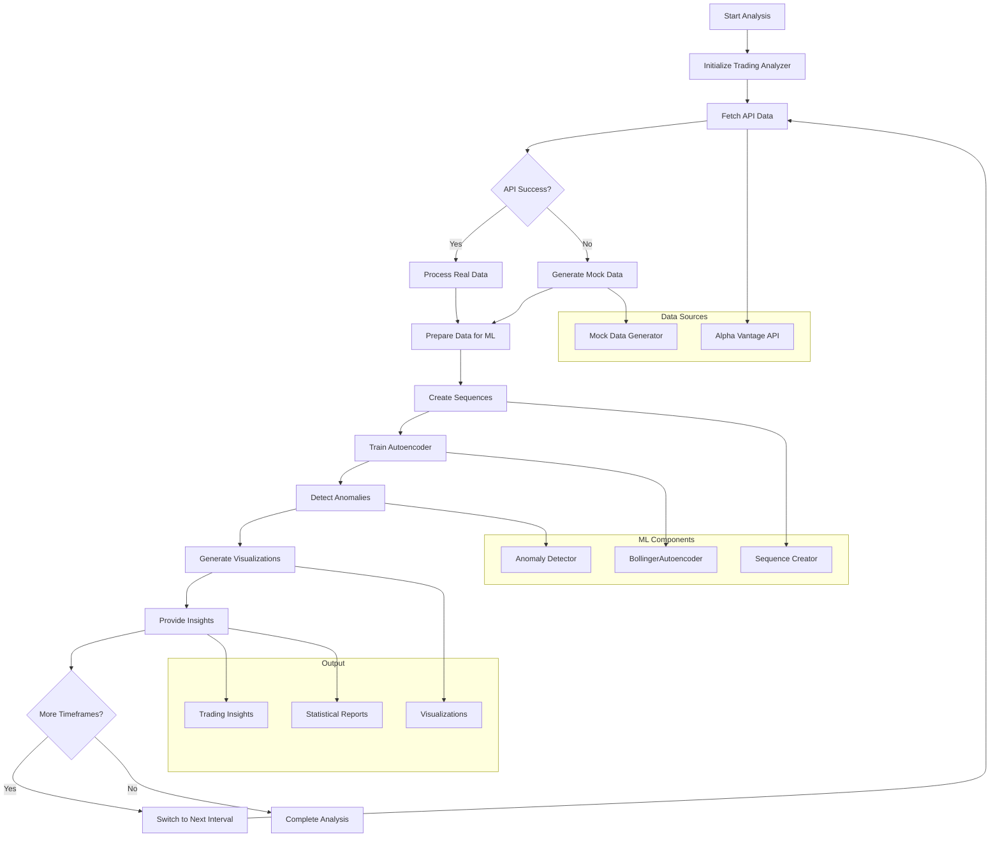

# AI-Powered Trading Analyzer Documentation

## link

[link](https://github.com/adamaslan/ai-fin3/blob/main/42_Ways_to_Add_Predictions.md)
## Overview
An intelligent trading analysis system that combines traditional Bollinger Bands with machine learning anomaly detection to identify unusual market patterns that may indicate significant price movements.

## System Architecture



## Technical Architecture Components

### 1. Multi-Layer Architecture & Setup
The code is structured in three main sections: basic imports/configuration, neural network definition, and the main trading analyzer class. It uses PyTorch for deep learning, pandas for data manipulation, and matplotlib for visualization. Key constants like `SEQUENCE_LENGTH=30` and `DEVICE` (CPU/GPU) are configured upfront for consistent usage throughout the system.

**Key Configuration:**
- `SEQUENCE_LENGTH = 30` - Temporal window size
- `LEARNING_RATE = 0.001` - Neural network learning rate
- `EPOCHS = 50` - Training iterations
- `BATCH_SIZE = 32` - Training batch size

### 2. Custom Autoencoder Neural Network
The `BollingerAutoencoder` class implements a compression-decompression neural network with:
- **Encoder**: Compresses input data (90 features → 64 → 32 → 16 dimensions)
- **Decoder**: Reconstructs original data (16 → 32 → 64 → 90 dimensions)
- **Purpose**: Learn normal Bollinger Band patterns so it can identify when patterns deviate significantly (anomalies)

```python
# Network Architecture
Input: 90 features (30 periods × 3 bands)
├── Encoder: 90 → 64 → 32 → 16
└── Decoder: 16 → 32 → 64 → 90
Output: Reconstructed 90 features
```

### 3. Dual Data Source Strategy
The system has two data acquisition methods:
- **Primary**: Fetches real-time Bollinger Bands and price data from Alpha Vantage API
- **Fallback**: Generates realistic mock data with proper volatility and trends if API fails
- Both methods ensure consistent DataFrame structure with columns: `['upper', 'middle', 'lower', 'close']`

**Data Flow:**
1. Attempt Alpha Vantage API call
2. Validate response structure
3. If failure → Generate mock data
4. Normalize column structure

### 4. Robust API Integration with Error Handling
The `fetch_bollinger_bands()` method includes:
- **Timeout protection**: 20-second limits prevent hanging requests
- **Response validation**: Checks for proper API response structure
- **Exception handling**: Catches timeouts, network errors, and malformed responses
- **Graceful degradation**: Automatically switches to mock data if API fails

**Error Handling Matrix:**
| Error Type | Response | Fallback Action |
|------------|----------|-----------------|
| Timeout | Log timeout message | Use mock data |
| Invalid API Key | Log API error | Use mock data |
| Network Error | Log network issue | Use mock data |
| Malformed Response | Log data issue | Use mock data |

### 5. Sequence-Based Time Series Processing
The `create_sequences()` function transforms Bollinger Band data into overlapping 30-period windows:
- **Input**: `[upper, middle, lower]` values over time
- **Output**: Flattened sequences of 90 features (30 periods × 3 bands)
- **Purpose**: Enables the autoencoder to learn temporal patterns in band behavior

**Sequence Creation Process:**
```
Time Series: [t1, t2, t3, ..., t100]
Sequences: 
- Seq1: [t1:t30] → flatten to 90 features
- Seq2: [t2:t31] → flatten to 90 features  
- Seq3: [t3:t32] → flatten to 90 features
- ...
```

### 6. Autoencoder Training Pipeline
The `train_autoencoder()` function implements a complete ML training workflow:
- **Data preprocessing**: MinMaxScaler normalization for stable training
- **Training loop**: 50 epochs with Adam optimizer and MSE loss
- **Batch processing**: 32-sample batches for efficient GPU utilization
- **Progress monitoring**: Loss tracking every 10 epochs

**Training Metrics:**
- **Optimizer**: Adam with 0.001 learning rate
- **Loss Function**: Mean Squared Error (MSE)
- **Convergence**: Monitored via reconstruction loss
- **Early Stopping**: Implicit via fixed epochs

### 7. Anomaly Detection Algorithm
The core anomaly detection works by:
- **Reconstruction error**: Measures how poorly the trained autoencoder reconstructs new data
- **Threshold calculation**: Uses 95th percentile of reconstruction errors as cutoff
- **Classification**: Data points with errors above threshold are marked as anomalies
- **Temporal alignment**: Properly aligns anomaly scores with original timestamp indices

**Algorithm Steps:**
1. Pass data through trained autoencoder
2. Calculate reconstruction error for each sequence
3. Compute 95th percentile threshold
4. Mark high-error sequences as anomalies
5. Map anomalies back to original timestamps

### 8. Multi-Timeframe Analysis
The system analyzes two different time intervals:
- **15-minute intervals**: For short-term trading signals and intraday patterns
- **60-minute intervals**: For broader trend analysis and longer-term anomalies
- Each timeframe gets independent training and anomaly detection for scale-appropriate insights

**Timeframe Comparison:**
| Interval | Use Case | Pattern Type | Signal Frequency |
|----------|----------|--------------|------------------|
| 15min | Day Trading | Short-term reversals | High |
| 60min | Swing Trading | Trend changes | Medium |

### 9. Advanced Data Visualization
The `visualize_data()` method creates comprehensive charts featuring:
- **Price overlay**: Black line showing actual stock price movement
- **Bollinger Bands**: Upper (red), middle (blue dashed), lower (green) bands
- **Band fill**: Gray shaded area between upper/lower bands for visual clarity
- **Anomaly markers**: Purple 'X' markers highlighting AI-detected unusual patterns

**Visualization Elements:**
- **Price Line**: Primary trend indicator
- **Bollinger Bands**: Volatility boundaries
- **Anomaly Markers**: ML-detected unusual patterns
- **Statistical Info**: Anomaly counts and rates

### 10. Intelligent Analysis & Insights
The system provides actionable trading intelligence:
- **Recent anomaly detection**: Focuses on last 24 periods for current market conditions
- **Statistical summary**: Reports anomaly rates and counts for each timeframe
- **Market interpretation**: Explains whether patterns are normal or suggest potential trend changes
- **Risk assessment**: Identifies periods of unusual volatility that may precede significant price movements

**Insight Categories:**
- **Trend Analysis**: Direction and strength indicators
- **Volatility Assessment**: Market stability metrics
- **Anomaly Significance**: Pattern deviation severity
- **Trading Recommendations**: Action-oriented guidance

## Key Features

### 🤖 Machine Learning Integration
- Custom autoencoder architecture for pattern recognition
- Unsupervised anomaly detection
- Adaptive threshold calculation
- Real-time model inference

### 📊 Comprehensive Analysis
- Multi-timeframe evaluation (15min, 60min)
- Bollinger Band integration
- Statistical anomaly reporting
- Visual pattern identification

### 🔒 Robust Error Handling
- API timeout protection
- Graceful fallback mechanisms
- Data validation checks
- Comprehensive exception handling

### 📈 Advanced Visualization
- Interactive chart generation
- Anomaly highlighting
- Statistical overlays
- Professional formatting

## Usage Instructions

### Prerequisites
```bash
pip install torch pandas numpy matplotlib sklearn requests python-dotenv seaborn
```

### Environment Setup
Create a `.env` file with your Alpha Vantage API key:
```
ALPHA_VANTAGE_API_KEY=your_api_key_here
```

### Running the Analysis
```python
# Initialize analyzer
analyzer = TradingAnalyzer(ALPHA_VANTAGE_API_KEY)

# Run complete analysis
analyzer.run_complete_analysis("AAPL")
```

## Key Innovation

Unlike traditional technical analysis that relies on fixed rules, this system uses machine learning to adapt to each stock's unique patterns, potentially identifying subtle anomalies that human traders might miss. The autoencoder learns the "normal" behavior of Bollinger Bands for a specific stock and flags deviations that could indicate significant market movements.

## Future Enhancements

- **Multi-asset correlation analysis**
- **Real-time streaming data integration**
- **Advanced ensemble anomaly detection**
- **Automated trading signal generation**
- **Portfolio-level risk assessment**

## Technical Requirements

- **Python 3.8+**
- **PyTorch 1.9+**
- **8GB+ RAM recommended**
- **GPU optional but recommended**
- **Alpha Vantage API key**

---

*This system represents a fusion of traditional technical analysis with modern machine learning, providing traders with AI-powered insights into market anomalies and potential trading opportunities.*