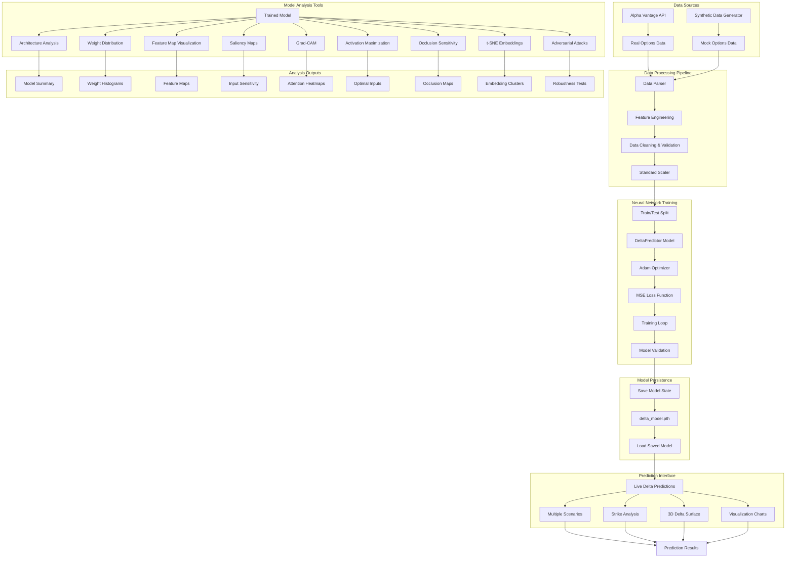
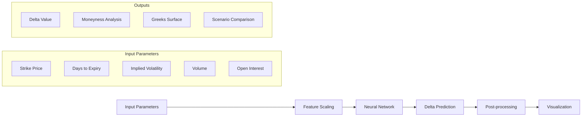

# Options Analysis and Delta Prediction System

## Overview

This document outlines a comprehensive system for analyzing neural network models and predicting options delta values using PyTorch. The system combines deep learning model analysis techniques with real-time options data processing.

## System Architecture



## Core Components

### 1. Data Processing Pipeline

The system handles both real and synthetic options data:

- **Real Data Source**: Alpha Vantage API for live options data
- **Synthetic Data**: Realistic mock data using Black-Scholes approximations
- **Feature Engineering**: Creates moneyness, time decay, and volatility features
- **Data Validation**: Filters invalid options and ensures data quality

### 2. Neural Network Architecture

```python
class DeltaPredictor(nn.Module):
    def __init__(self, input_size=5, hidden_size=64, output_size=1):
        super(DeltaPredictor, self).__init__()
        self.network = nn.Sequential(
            nn.Linear(input_size, hidden_size),
            nn.ReLU(),
            nn.Dropout(0.2),
            nn.Linear(hidden_size, hidden_size // 2),
            nn.ReLU(),
            nn.Dropout(0.1),
            nn.Linear(hidden_size // 2, output_size),
            nn.Sigmoid()  # Delta is between 0 and 1
        )
```

**Input Features**:
- Log moneyness (ln(Strike/Stock))
- Days to expiration
- Implied volatility
- Trading volume
- Open interest

### 3. Model Analysis Framework

The system includes 10 comprehensive analysis methods:

#### Architectural Analysis
- **Model Summary**: Layer-by-layer parameter counts and shapes
- **Weight Distribution**: Histograms showing weight and bias distributions

#### Feature Understanding
- **Feature Maps**: Visualizes intermediate layer activations
- **Saliency Maps**: Shows input pixel importance for predictions
- **Grad-CAM**: Creates attention heatmaps over input features

#### Model Behavior
- **Activation Maximization**: Generates inputs that maximize specific neurons
- **Occlusion Sensitivity**: Tests prediction robustness to input masking
- **t-SNE Embeddings**: Visualizes high-dimensional feature representations

#### Robustness Testing
- **Adversarial Attacks**: FGSM attacks to test model stability
- **Layer-wise Relevance Propagation**: Explains prediction reasoning (conceptual)

### 4. Prediction Workflow



## Usage Examples

### Training and Saving a Model

```python
# Initialize predictor with API key
predictor = LiveDeltaPredictor(api_key)

# Get options data (real or synthetic)
options_df = predictor.get_sample_data()

# Prepare training data
features, targets = predictor.prepare_training_data(options_df)

# Train model
losses = predictor.train_model_fast(features, targets, epochs=50)

# Save trained model
predictor.save_model('delta_model.pth')
```

### Loading and Making Predictions

```python
# Load saved model
predictor = LiveDeltaPredictor(api_key)
predictor.load_model('delta_model.pth')

# Make single prediction
delta = predictor.predict_delta(
    strike=220, 
    days_to_expiry=30, 
    implied_vol=0.25
)

# Analyze multiple scenarios
results = predictor.predict_multiple_scenarios(
    strikes=[210, 220, 230],
    days_list=[7, 30, 90],
    iv_list=[0.20, 0.25, 0.35]
)
```

### Model Analysis

```python
# Load model for analysis
model = load_model('delta_model.pth', SimpleCNN)

# Run comprehensive analysis
analyze_architecture(model, input_size=(1, 28, 28))
analyze_weights(model)
analyze_feature_maps(model, 'conv2', sample_input)
analyze_saliency(model, sample_input)
analyze_grad_cam(model, 'conv2', sample_input)
analyze_tsne(model, data, labels)
```

## Technical Specifications

### Model Requirements
- **Framework**: PyTorch 1.9+
- **Dependencies**: numpy, pandas, matplotlib, sklearn, torchsummary
- **Input Shape**: 5 features (financial metrics)
- **Output**: Single delta value (0-1)

### Data Requirements
- **Minimum Samples**: 20+ valid options for training
- **Features**: Strike, expiry, IV, volume, open interest
- **Validation**: Filters for realistic delta ranges (0.01-0.99)

### Performance Metrics
- **Training**: MSE loss with Adam optimizer
- **Evaluation**: R² score on train/test splits
- **Validation**: Cross-validation with multiple scenarios

## Visualization Capabilities

The system provides multiple visualization types:

1. **Training Progress**: Loss curves and convergence plots
2. **Delta Surfaces**: 3D visualization of delta across strikes/time
3. **Scenario Analysis**: Comparative charts across different conditions
4. **Model Internals**: Weight distributions, feature maps, attention maps
5. **Robustness Testing**: Adversarial examples and occlusion sensitivity

## Integration Points

### API Integration
- Alpha Vantage for real-time options data
- Extensible to other financial data providers
- Error handling for API failures with synthetic fallback

### Model Persistence
- Complete model state saving (weights + preprocessing)
- Version control compatible (.pth format)
- Cross-session reproducibility

### Analysis Pipeline
- Modular analysis components
- Extensible framework for new analysis methods
- Automated report generation capabilities

## Best Practices

### Data Quality
- Validate input ranges and distributions
- Filter unrealistic options data
- Handle missing values appropriately

### Model Training
- Use appropriate train/validation splits
- Monitor for overfitting with dropout
- Scale features consistently

### Analysis Interpretation
- Consider model limitations and assumptions
- Validate predictions against theoretical values
- Test robustness across different market conditions

## Future Enhancements

Potential improvements to the system:

1. **Multi-Asset Support**: Extend beyond single stock options
2. **Real-Time Updates**: Streaming data integration
3. **Advanced Greeks**: Gamma, theta, vega predictions
4. **Ensemble Methods**: Multiple model combinations
5. **Risk Management**: VaR and stress testing integration
6. **Web Interface**: Dashboard for non-technical users

This comprehensive system bridges the gap between theoretical options pricing and practical machine learning applications, providing both predictive capabilities and deep model understanding through extensive analysis tools.